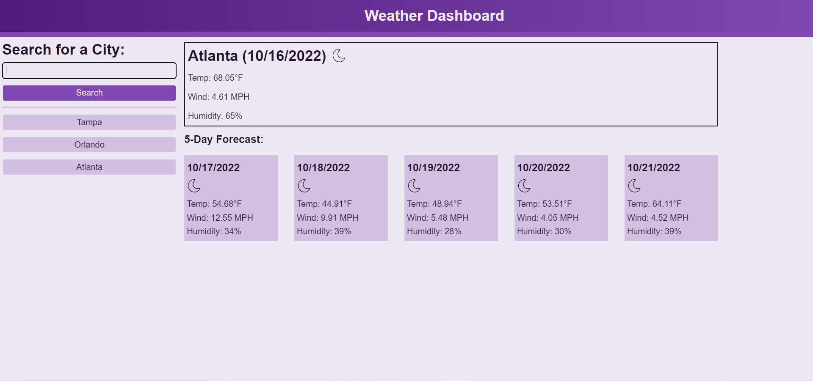

# Server-side-API-Weather-Dashboard

## Description

This is the 'Module 06' challenge assignment for the UCF coding bootcamp.

Based on the starter code we were given, we were tasked with creating a weather dashboard from the ground up. This project helps to build our skills with using server-side APIs and getting more familiar with them. The jist of this project is that it will show you the weather forecast based on a search prompt.

## Installation

1. Copy the SSH URL
2. Open a terminal, navigate to the path where you want to open the code, and then enter into the terminal 'git clone [ssh url]'
3. ?
4. Profit

## Usage

You can install Visual Studio Code and get the 'Live Server' extension if you want to test it out in a web browser, otherwise you can just follow this [link](https://binnyboy1.github.io/Server-side-API-Weather-Dashboard/).

- Typing a city in the search prompt and clicking Search will show the weather forecast for the aformentioned city as well as the 5 days that follow.
- After entering in a city, it will store your search history
- Clicking on a city prompt in the search history will load the weather forecast for that city.